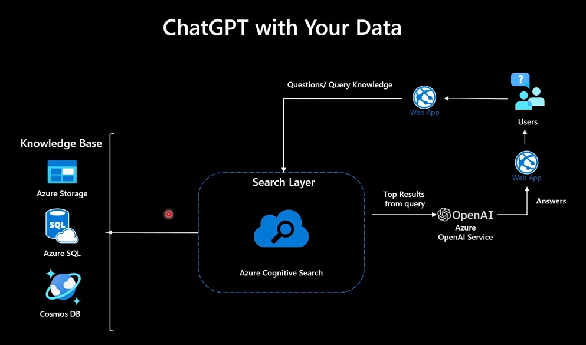

ConverDocs is a project that I'd like very much to develop as soon as possible.
ConverDocs stands for "conversational documentation". Essentially, it is a way to cater documentation through a chatbot interface using natural conversation. Think of ChatGPT trained with the already available documentation for a software or service.  

While many parties are offering out-of-the-box solutions in which the Large Language Model (LLM) digests the data in seconds and the chatbot is immediatelyt ready for deployment (e.g., [Botsonic](https://writesonic.com/botsonic)), there are many limitations in the way the answers are presented.

Some things I'd like to see:

- Computer Vision: The LLM should be able to incorporate image processing from the guide's screenshots and make sense of them. It's very likely that some guidance should be provided, maybe in the alt tags ("This is a screenshot of process A, step 2, it should be presented when and when-not").

- Differentiated verbosity controls: 

By the end of 2022 Microsoft had already presented a demo that runs on Azure "_A sample app for the Retrieval-Augmented Generation pattern running in Azure, using Azure Cognitive Search for retrieval and Azure OpenAI large language models to power ChatGPT-style and Q&A experiences._" and that can be forked from [here](https://github.com/Azure-Samples/azure-search-openai-demo). Video presentation of this feature [here](https://www.youtube.com/watch?v=3t3qZu1Dy1k). 

A more refined (and recent) presentation of the same concepts can be found in the video series by Abdul Zedan: [Azure OpenAI 101: Powering ChatGPT with your Data - A Deep Dive](https://youtu.be/Z6fk1gZjDNg?si=wDsaVZILFFpX_PXU). 

Let's use it as the foundation for this project. Off we go.

## Architecture

Quick Description:  The Web App in the diagram will be the chatbot which will be operating at the endpoint: https://converdocs.openai.azure.com/ 

The user asks a question and the query is sent to the Search Layer, based on Azure Cognitive Search. By that time, Azure Cognitive Search already has grounded the data from the knowledge base provided by any of the storage options available in Azure Storage.

Azure Cognitive Search sends the top results from query to the OpenAI API as provided by Azure OpenAI Service. GPT does its magic and delivers the answer back to the user through the same Web App. 

It looks very simple and maybe it is, we will see!

**At a later stage, the MS Power Platform could be used to improve the features of the chatbot (virtual agents). At the beginning, we will use the chatbox as provided by the OpenAI Studio.*

## Knowledge Base
The source data for the engine will be its own documentation, the documentation for ConverDocs.

The chatbot will reference the source of the knowledge to the markdown files, and the user will validate the bot answers there. Thus, they must be able to stand by themselves as fully functional documentation.

To improve machine reading we are going to write everything in markdown files with markdown markup. The screenshots will be enconded as pngs and annotated with a consistent method and style using Snagit, a  screenshot editor that allows to template annotations.

The mds and the pngs will be uploaded to Azure Cognitive Services, and a copy will be available [here]. 

> **Note:** A requirement for this project is to be able to feed insight to GPT about the content of the screenshots, diagrams, etc., in the documentation. We need to figure out how to apply OCR, classify, tag, and organize such data using a consistent method that can be used throughout the documentation. Perhaps this is the main peculiarity of this project, the concern with incorporating the images and/or the content of the images, as long as they enhance the responses.

### Sourcing the Knowledge to GPT

We will be using [Retrieval Augmented Generation (RAG)](https://research.ibm.com/blog/retrieval-augmented-generation-RAG) as the method to source the documentation to the model. Reasons? We need to ground the chatbot answers to the documentation, which means to list the places in the documentation used to craft the answer.

RAG will also help reduce hallucinations and find vaccums of knowledge, as the model is comfortable saying: "I don't know".

## Azure Setup
The first thing to do in Azure is to fulfill the [prerequisites](https://learn.microsoft.com/en-us/azure/ai-services/openai/quickstart?pivots=programming-language-studio&tabs=command-line#prerequisites) for using Azure OpenAI services, which include:
- Azure subscription with granted access to Azure OpenAI Services
- Create an Azure OpenAI Resource and a deployment

### Language Model

| Spec            | Selection       |
| --------------- | --------------- |
| Model name      | gpt-35-turbo    |
| Deployment name | converdocsgpt   |
| Model revision  | 0301            |
| Deployment type | standard        |
| Capacity        | 120K TPM        |

| Parameter         | Value                                      |
| ----------------- | ------------------------------------------ |
| Temperature       | 0.5                                        |
| Max Response      | 150                                        |
| Top P             | 0.5                                        |
| Frequency Penalty | 0.5                                        |
| Presence Penalty  | 0.5                                        |
| Stop Sequence     | 'Let me know if you have any other questions' |

A low temperature value (e.g. 0.5-0.7) may be more appropriate for this use case. This allows the AI assistant to generate responses that are both diverse and relevant to the user's inquiry, while still maintaining a high level of coherence and accuracy.

Short and to-the-point responses that are easy to read and can help to keep the conversation flowing, preventing cognitive overload.

This value was suggested by the bot itself: "allows to generate responses that are both diverse and relevant to the user's inquiry, while still maintaining a high level of coherence and accuracy."

A frequency penalty value of around 0.5-1.0 and a presence penalty value of around 0.5-1.0 can be a good starting point. These values will encourage the AI assistant to generate responses that are diverse and relevant to the user's inquiry, while still maintaining a high level of coherence and accuracy.

The stop sequence is a phrase that signals to the AI assistant that the user has received a satisfactory response and that it can stop generating additional information.

### Assistant setup
**System Message:** 'You are an AI assistant that helps people find and understand information in the documentation of ConverDocs.' We keep this short because the system message counts towards the token limit of every user message.

